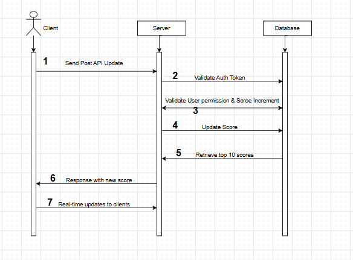

# API SPECIFICATION
## Endpoint:
**POST** ``/api/score/update``

## Request: ##

**Method**: POST

**URL:** /api/score/update

**Headers**

Authorization: Bearer token for authentication (JWT).

**Body (JSON)**
```json
{
  "id": "number",        // User's unique identifier
  "score_increment": "number" // Increment to add to the user's score
}
```

**Response:**

***200 OK***
```json
{
  "message": "Score updated successfully",
  "new_score": "number",      // New total score for the user
  "top_10_scores": [          // List of the top 10 users with their scores
    {
      "id": "number",
      "score": "number"
    },
  ]
}
```
***400 Bad Request***
```json
{
  "error": "Invalid score increment or missing user ID"
}
```

***401 Unauthorized***
```json
{
  "error": "Unauthorized. Invalid token"
}
```

***403 Forbidden***
```json
{
  "error": "Forbidden. You are not allowed to update this score"
}
```

***500 Internal Server Error***
```json
{
  "error": "Internal server error"
}
```

# SYSTEM DESIGN

## Diagram: API Flow

**JWT Authentication:** The API will validate the JWT token sent in the Authorization header. Only valid, signed tokens will be accepted.

**User Roles:** There must be a role-based system that ensures that only users who have completed the action that increases their score can update it. Unauthorized users will be blocked.



## Database Design ##

**``users`` Table:** Stores user information.
```sql
CREATE TABLE users (
    id INT AUTO_INCREMENT PRIMARY KEY,
    username VARCHAR(50) UNIQUE NOT NULL,
    email VARCHAR(100) UNIQUE NOT NULL,
    total_score INT DEFAULT 0,
    created_at TIMESTAMP DEFAULT CURRENT_TIMESTAMP,
    updated_at TIMESTAMP DEFAULT CURRENT_TIMESTAMP ON UPDATE CURRENT_TIMESTAMP,
);
```

**``score_history`` Table:** Logs score update history.
```sql
CREATE TABLE score_history (
    id INT AUTO_INCREMENT PRIMARY KEY,
    user_id INT,
    score_increment INT NOT NULL,
    created_at TIMESTAMP DEFAULT CURRENT_TIMESTAMP,
    updated_at TIMESTAMP DEFAULT CURRENT_TIMESTAMP,
    FOREIGN KEY (user_id) REFERENCES users(id) ON DELETE CASCADE
);
```
